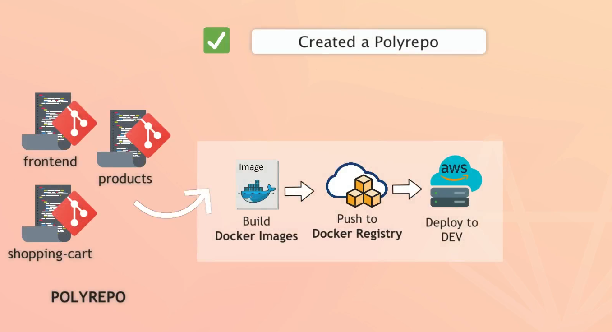
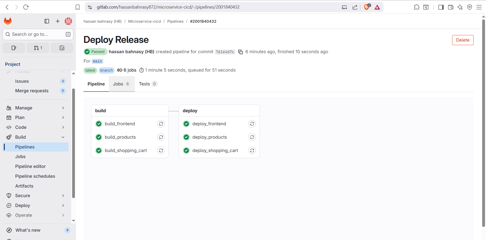
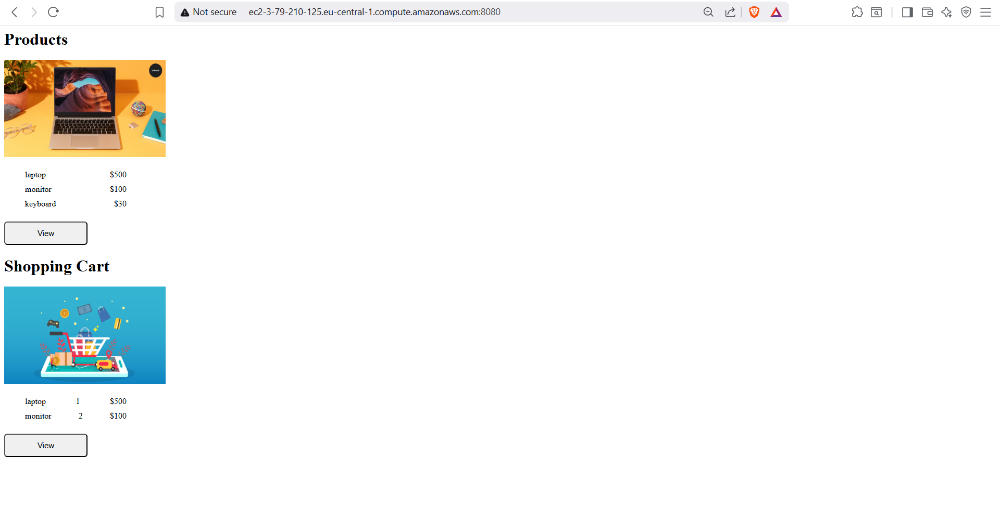

# 🚀 **microservice-cicd – Polyrepo Microservices CI/CD Project**

> Independent CI/CD pipelines for multiple Node.js microservices using GitLab CI/CD and Docker.

---

## 📚 **Table of Contents**

* [Project Overview](#-project-overview)
* [Microservices Architecture](#-microservices-architecture)
* [Repository Structure](#-repository-structure)
* [CI/CD Pipeline](#-cicd-pipeline)
* [Build & Containerization](#-build--containerization)
* [Deployment Strategy](#-deployment-strategy)
* [How to Run Locally](#️-how-to-run-locally)
* [Author](#-author)

---

## 🧩 **Project Overview**

This project demonstrates a **polyrepo-style microservices CI/CD setup** using GitLab CI/CD.

The application consists of **three independent microservices**, each with its own build and deployment lifecycle:

* **Frontend Service** – User interface
* **Products Service** – Manages product data
* **Shopping Cart Service** – Manages cart functionality

Each microservice:

* Is built as a Docker image
* Has its own CI/CD job
* Is deployed independently based on code changes

---

## 🏗 **Microservices Architecture**

```
┌──────────────────┐
│ GitLab Repository│
│ microservice-    │
│ cicd             │
└──────┬───────────┘
       │ GitLab CI/CD
       ▼
┌────────────────────────────┐
│ GitLab Runner (EC2)        │
│ Docker + Shell Executor    │
└──────┬─────────────────────┘
       │ build & push images
       ▼
┌────────────────────────────┐
│ GitLab Container Registry  │
└──────┬─────────────────────┘
       │ pull images
       ▼
┌────────────────────────────┐
│ EC2 Server (Ubuntu)        │
│ Docker Compose             │
│ Microservices Network      │
└────────────────────────────┘
```


---

## 📂 **Repository Structure**

```
microservice-cicd/
├── frontend/
├── products/
├── shopping-cart/
├── docker-compose.yaml
└── .gitlab-ci.yml
```

Each folder contains:

* Node.js application
* Dedicated `Dockerfile`
* Independent CI/CD build & deploy logic

---

## 🔄 **CI/CD Pipeline**

### Pipeline Stages

* **Build**
* **Deploy**

### Pipeline Rules

* Runs on `main` branch
* Runs on merge request events
* Uses path-based triggers (`only: changes`) to deploy only modified services

---

## 🐳 **Build & Containerization**

* Each microservice has its own `Dockerfile`
* Docker images are built per service
* Images are tagged with fixed service versions
* Images are pushed to **GitLab Container Registry**

Example image naming:

```
registry.gitlab.com/<group>/microservice/frontend:1.3
registry.gitlab.com/<group>/microservice/products:1.8
registry.gitlab.com/<group>/microservice/shopping-cart:2.1
```

---

## 🚀 **Deployment Strategy**

* Remote deployment using **Docker Compose**
* SSH-based deployment from GitLab Runner
* One shared Docker network for inter-service communication
* Each microservice deployed independently

### Deployment Logic

* Build & deploy only the service that changed
* Reusable CI jobs using `extends`
* Environment variables injected at runtime

---

## ▶️ **How to Run Locally**

### Build Images

```bash
docker build -t ms-frontend:1.0 frontend
docker build -t ms-products:1.0 products
docker build -t ms-shopping-cart:1.0 shopping-cart
```

### Run Containers

```bash
docker run -d -p 3000:3000 ms-frontend:1.0
docker run -d -p 3001:3001 ms-products:1.0
docker run -d -p 3002:3002 ms-shopping-cart:1.0
```

### Using Docker Compose

```bash
export COMPOSE_PROJECT_NAME=frontend
export DC_IMAGE_NAME=ms-frontend
export DC_IMAGE_TAG=1.0
export DC_APP_PORT=3000

docker-compose up -d
```

### Screenshots



---

## 👤 **Author**

* **Name:** Hassan El Bahnasy
* **Email:** [hassanbahnasy872@gmail.com](mailto:hassanbahnasy872@gmail.com)
